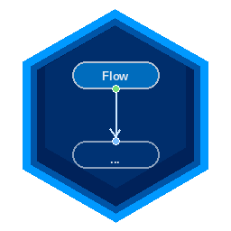

# FlowPlusPlus

> *Because sometimes, you just want to think in boxes and arrows to be out of the box.*



A visual flowchart interpreter built with **C++17** and **Qt 6**, loosely following the spirit of [Crafting Interpreters](https://craftinginterpreters.com/) by Robert Nystrom except instead of typing code, you draw it.


---

<div align="center">
  <video src="demo-video/demo.mp4" width="100%" controls>
    Your browser does not support the video tag.
  </video>
</div>

## What is this?

FlowPlusPlus lets you build programs visually, drag nodes onto a canvas, connect them with arrows, and hit **Run**. The interpreter walks the graph and executes your logic, node by node.

No syntax errors. No semicolons. Just flow _(with the vibe)_.

---

## Node Types

| Shape | Flowchart Symbol | What it does |
|-------|-----------------|--------------|
| Rounded rectangle | Start / Stop | Marks the beginning and end of execution |
| Rectangle | Process | Assignment or expression — `x = 5 + 3` |
| Diamond | Decision | Condition branches Yes (right) or No (bottom) |
| Parallelogram | Input / Output | Read from user or print a value |

---

## Features

- **Visual canvas** — dark-themed QGraphicsScene with pan, zoom, and fit-to-view
- **Full interpreter** — Lexer → Parser → AST → Graph Walker, built from scratch
- **Variables** — define and use variables across nodes (`x = 5`, `print x`)
- **Control flow** — loops and branches via Decision nodes and backward arrows
- **Save / Load** — `.fpp` JSON format, open and save your flowcharts
- **Undo / Redo** — full history with Ctrl+Z / Ctrl+Y
- **Copy / Paste** — Ctrl+C / Ctrl+V with multi-select support
- **Minimap** — VSCode-style overview panel, click to pan
- **Sample programs** — 6 built-in examples via File → Open Sample
- **Cross-platform** — ships on Linux (Flatpak), Windows (.zip), and macOS (.dmg)

---

## Expression Syntax

Node labels are mini-expressions evaluated at runtime:

```
# Process nodes
x = 10
result = x * 2 + 1
name = "Abby"

# Decision nodes (condition → Yes/No branch)
x > 5
remainder == 0
score >= 90

# Output nodes (auto-prefixed with print)
"Hello, World!"
"Result: " + result
x

# Input nodes (auto-prefixed with input)
x
score
```

Supported operators: `+` `-` `*` `/` `%` `==` `!=` `<` `<=` `>` `>=` `!` `and` `or`

---

## Getting Started

### Download

Grab the latest release for your platform from the [Releases page](https://github.com/abhyuday-fr/FlowPlusPlus/releases):

| Platform | File | How to run |
|----------|------|------------|
| Linux | `FlowPlusPlus-linux.flatpak` | `flatpak install FlowPlusPlus-linux.flatpak` |
| Windows | `FlowPlusPlus-windows-x64.zip` | Extract and run `FlowPlusPlus.exe` |
| macOS | `FlowPlusPlus-macos.dmg` | Open DMG, drag to Applications |

### Build from source

```bash
git clone https://github.com/abhyuday-fr/FlowPlusPlus.git
cd FlowPlusPlus
cmake -B build -G Ninja -DCMAKE_BUILD_TYPE=Release
cmake --build build
./build/FlowPlusPlus
```

**Requirements:** Qt 6.5+, CMake 3.19+, Ninja, C++17 compiler

---

## Sample Programs

Load any of these from **File → Open Sample**:

| Sample | What it shows |
|--------|--------------|
| Hello World | Basic output node |
| Calculator | Input + arithmetic operations |
| Countdown | Loop with a Decision node |
| Even or Odd | Yes/No branching |
| Fibonacci | Complex loop with multiple variables |
| Grade Checker | Nested decision chains |

---

## How it works

```
Node label (text)
      ↓
   Lexer          → tokens
      ↓
   Parser         → AST (Expr tree)
      ↓
   evaluate()     → Value (number / string / bool / nil)
      ↓
   Graph walker   → follows connections to next node
```

The flowchart **is** the program. Control flow comes from arrows, not keywords.
Loops are just backward connections. Branches are Decision nodes.

See [interpreter_explained_FPP.md](interpreter_explained_FPP.md) for a deep dive.

---

## Progress

Built chapter by chapter, following *Crafting Interpreters*:

- ✅ Chapter 1 — Canvas window, toolbar, dark theme
- ✅ Chapter 2 — FlowNode base class, FlowConnection
- ✅ Chapter 3 — Concrete node shapes (Start, Stop, Process, Decision, I/O)
- ✅ Chapter 4 — Placing nodes on canvas from toolbar
- ✅ Chapter 5 — Connecting nodes with arrows, Yes/No ports
- ✅ Chapter 6 — Value & Environment (variables, scope chain)
- ✅ Chapter 7 — Interpreter: Lexer, Parser, AST, Graph Walker
- ✅ Chapter 8 — Control flow, loops, error highlighting
- ✅ Chapter 9 — Save/Load (.fpp JSON format)
- ✅ Chapter 10 — Minimap
- ✅ Chapter 11 — Multi-select + Ctrl+C/Ctrl+V
- ✅ Chapter 12 — Undo/Redo (QUndoStack)
- ✅ Chapter 13 — Sample .fpp files
- ✅ Chapter 14 — Packaging + GitHub Actions CI/CD

~~can't wait to make a releasable version :)~~

**I did it :D** — [v1.0.4 is live](https://github.com/abhyuday-fr/FlowPlusPlus/releases)

---

## What's coming next

The interpreter works. The canvas is solid. Here's what's on the roadmap:

**Polish**
- [ ] Autosave — periodic save to a temp file, recovery on crash
- [ ] "Unsaved changes" prompt on close / new file
- [ ] Grid snapping for cleaner node alignment

**Power**
- [ ] Export flowchart as PNG or SVG image
- [ ] Better interpreter error messages (highlight the failing node)
- [ ] System clipboard — copy/paste between separate FlowPlusPlus windows

**Advanced**
- [ ] Multiple Start nodes — run independent flowcharts sequentially
- [ ] Function subgraphs — call one flowchart from another
- [ ] Parallel execution via QThread

---

## Tech Stack

- **C++17**
- **Qt 6.5+** — Widgets, QGraphicsScene, QUndoStack
- **CMake + Ninja**
- **Flatpak** (Linux distribution)
- **GitHub Actions** (CI/CD for Linux, Windows, macOS)
- Developed on Fedora Linux with Qt Creator

---

## Contributing

Issues and PRs are welcome. If you find a bug or want to add a node type, go for it.

---

## License

MIT
see [license](license) for details.

---

*Built with way too much fun and not enough sleep.*
